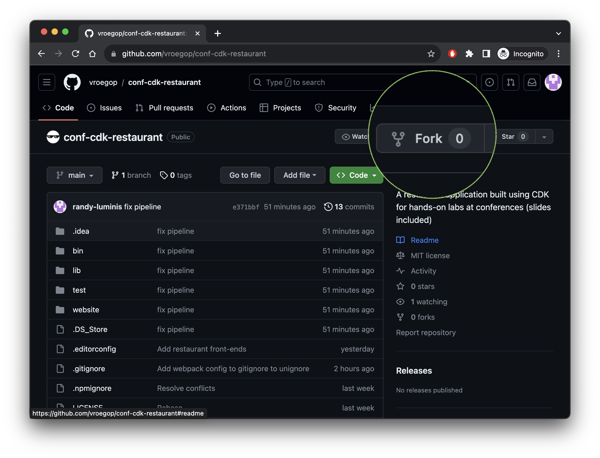
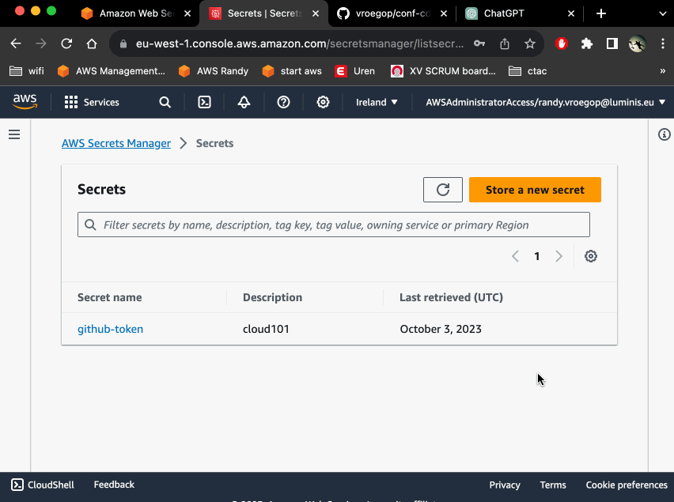

# Welcome to your CDK TypeScript project

The `cdk.json` file tells the CDK Toolkit how to execute your app.

<<<<<<< Updated upstream
## Useful commands
=======
> Wait, all the CDK code looks exactly the same as chapter 1! Except some empty classes.
>>>>>>> Stashed changes

* `npm run build`   compile typescript to js
* `npm run test`    perform the jest unit tests
* `npm run serve`   serve the restaurant app for local development
* `cdk deploy`      deploy this stack to your default AWS account/region
* `cdk diff`        compare deployed stack with current state
* `cdk synth`       emits the synthesized CloudFormation template

<<<<<<< Updated upstream
# Chapter 1

Hello and welcome to Chapter 1!

In this chapter we are going to do a few things:

1. Create a fork of https://github.com/vroegop/conf-cdk-restaurant
2. Create an access key in GitHub to allow AWS to create a webhook
3. Add the access key to AWS Secrets Manager
4. In your fork, change the strings with the words 'changeit' to something else
5. Install [AWS CLI via the official website](https://docs.aws.amazon.com/cli/latest/userguide/getting-started-install.html)
6. Then install CDK (`npm install -g aws-cdk`)
7. Finally run `npm install`
8. Run a few checks: `npm run build` `npm run test`
9. Create an AWS SSO profile: `aws configure sso`
10. Log in `aws sso login --profile {yourprofile}`
11. Bootstrap your profile `cdk bootstrap --profile {yourprofile}`
12. Deploy your pipeline to AWS `cdk deploy --profile {yourprofile} {yourstackname}`

# How-to

1. To create a fork:

2. Create an access key in GitHub

https://github.com/settings/tokens/new

I usually check every box except deleting the repository and creating keys, not sure what the minimum requirements are.

3. Add the key to AWS Secrets Manager

* Go to AWS Secrets Manager
* Click Store a new secret
* Choose 'Other type'
* The key must be github-token (AWS CodePipeline will recognize the token automatically that way)
* The value must be the contents of your secret token

4. Change the word changeit to something else (like your GitHub handle for uniqueness)

 In the file `lib/conf-cdk-pipeline-stack.ts`

5. Install [AWS CLI via the official website](https://docs.aws.amazon.com/cli/latest/userguide/getting-started-install.html)

 I'm lazy, follow their guide.

6. Install CDK CLI via NPM

Maybe you need to install node.js first.

> `npm i -g aws-cdk`

7. Run `npm install` in the directory of your fork (which you cloned to your machine)

8. Run a few checks: `npm run build`, `npm run test`

9. Configure the AWS SSO

* Tick some 'allow' boxes in your browser that opened automatically
* Then in the console, select the AWS account of the sandbox if required

10. Log in `aws sso login --profile {yourprofile}`

In my example the profile name would be 'conference' so the command 

> `aws sso login --profile conference`

11. Bootstrap your pipeline to AWS

This step is required and will create an S3 bucket with your configurations

> `cdk bootstrap --profile {profile}`

12. Deploy your pipeline to AWS

> `cdk deploy --profile {profile} {yourstackname}`

* The stackname is `changeitPipeline`
* This means if you set the profile and changeit to 'conference' the command would be:
> `cdk deploy --profile conference conferencePipeline`
* Deploying requires you to click yes a few times
* Check the AWS Console, CodePipeline for the status

## Succesful?!

If so, your website should be up and running!

You changed 'changeit' to something else, this will be your subdomain.

> If you are on the Luminis Sandbox the url will be changeit.cloud101.nl

> If you are on the Eleven Sandbox the url will be changeit.cloud111.nl
=======
> Yea that's intentional. It's your job to change the code now. Only the readme and website are updated. The empty classes are mainly to make sure stack names are consistent.
> 
> Don't forget to change 'changeit' to your selected phrase again. Use the exact same one otherwise duplicate stacks will rise, eat up all the resources and cause global warming.
> 
> Are you stuck and want to cheat you can peek at 'chapter 3'.

Developers:

> That's the most awesome thing ever, thank you great guide! Can I use ChatGPT too?

Guide:

> That's what we did, stuff like that will make our life easy.
> 
> The website, our front-end, code is updated in such a way that you should be able to only change CDK code and, with those changes, get the front-end functional. This means that deploying the stack as-is, you will end up with a front-end that does not work fully. On to quest 1!

# Quest 1

The restaurant is about to open. The website has a problem, all the data in the website was front-end only! The waiter and kitchen
applications didn't communicate with each other.

There were two files: kitchen.json and waiter.json. These files were useless. We need an API!

What the restaurant needs from you:

1. Create an API to which both the waiter and kitchen app can send requests
2. Add a database to the API
3. Make sure orders from the waiters are stored in the database
4. Make sure the kitchen app can read those orders

The website is already updated and both apps call the /api endpoint.

We are planning on working event-driven. This means we send events to the API and to keep
things simple for now, we also get events from the API. This is not optimal, we want to
project the events to a readable datastructure later on, but the agile manifesto tells us:

[Simplicity--the art of maximizing the amount of work not done--is essential.](https://agilemanifesto.org/principles.html)

Hints are provided in the file `conf-cdk-restaurant-event-api-stack.ts`.
>>>>>>> Stashed changes
