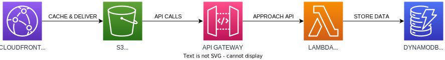
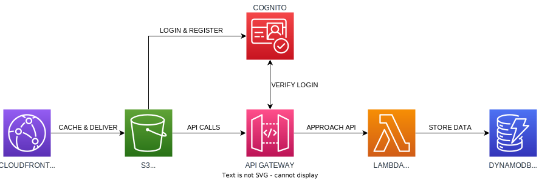

# Chapter 3

You are now in chapter 3.

Your first task: make sure `/settings.ts` contains **EXACTLY** the same
properties as in the previous chapter. This makes sure no duplicate stacks
are created.

# Current status

# What is the plan

# What do I do?

The solution is available in the 'chapter-4' branch if you want to have the solution as an example.

Fewer examples are provided in the code, but you can peek into that branch for the solutions.

1. Implement the cognito stack (this is provided to prevent duplicate stack names in Cloudformation)
2. Add the cognito service as authenticator to the API Gateway (look for Todo: in your IDE, add it there)
3. The front-end (website) is already updated, this will try to authenticate on the /authenticate endpoint. Make it work by pointing that endpoint to Cognito.
4. If you did it right, the API is only accessible after logging in.